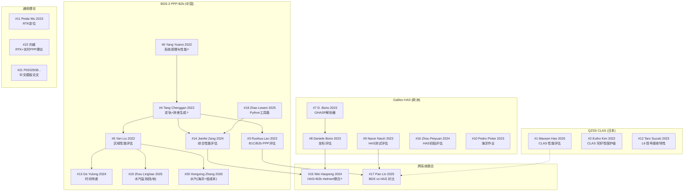

# Paper 论文关系图谱

生成时间：2026-05-20 | 论文总数：22 篇

---

## 1. 总览：三大系统 + 两类交叉

```
                        ┌──────────────────────────────────────┐
                        │          GNSS PPP 增强服务            │
                        └──────────────────────────────────────┘
                                      │
            ┌─────────────────────────┼─────────────────────────┐
            │                         │                         │
     ┌──────▼──────┐          ┌──────▼──────┐          ┌──────▼──────┐
     │ BDS-3       │          │ Galileo     │          │ QZSS        │
     │ PPP-B2b     │◄────────►│ HAS         │          │ CLAS (L6)   │
     │ (中国)      │  联合/比较 │ (欧洲)      │          │ (日本)      │
     └──────┬──────┘          └──────┬──────┘          └──────┬──────┘
            │                        │                        │
       12 篇                    6 篇                    3 篇
```

**另有 2 篇通用 GNSS PPP/RTK 理论论文（#21、#22），属于更广泛的理论基础。**

---

## 2. 按系统的论文归属

### 2.1 BDS-3 PPP-B2b（12 篇）—— 核心研究方向

#### 服务端生成（2 篇）
| # | 论文 | 核心内容 |
|---|------|---------|
| 4 | Tang Chenggan 2022 | 区域站+ISL 联合定轨、Kalman 实时钟差估计——**来自服务运营方** |
| 6 | Yang Yuanxi 2022 | BDSBAS + PPP-B2b 系统原理与性能——**杨元喜院士综述** |

> **关系**：#6 是顶层系统设计视角，#4 是工程实现细节。两者互补。#6 定义了 PPP-B2b 的服务框架，#4 给出了具体的定轨/钟差生成算法。

#### 性能评估（5 篇）
| # | 论文 | 评估重点 |
|---|------|---------|
| 3 | Ruohua Lan 2022 | B1C/B2b 单双频 PPP，对比 IGS RTS |
| 5 | Yan Liu 2022 | 中国及周边区域 PPP-B2b 可用性（88.76%→60.91%） |
| 14 | Jianfei Zang 2024 | BDS-3 PPP-B2b 服务综合性能评估 |
| 16 | Zhou Peiyuan 2024 | Galileo HAS 初始性能评估 |
| 17 | Pan Lin 2025 | BDS B2b 与 Galileo HAS 直接对比 |

> **关系链**：#3 (2022, 早期评估) → #5 (2022, 区域可用性) → #14 (2024, 全面评估) → #17 (2025, 跨系统对比)。评估从单系统走向双系统对比，逐年深化。

#### 应用（3 篇）
| # | 论文 | 应用场景 |
|---|------|---------|
| 13 | Ge Yulong 2024 | PPP-B2b 时间传递 |
| 19 | Zhou Linghao 2025 | PPP-B2b 水汽监测（武汉，25天实验） |
| 20 | Hongxing Zhang 2026 | PPP-B2b 海洋 PWV 传感 + 低成本接收机 |

> **关系**：#19 和 #20 都是水汽应用（PWV），#19 是陆地站（武汉），#20 是海洋场景+低成本设备。#13 是时间传递——这三个共同构成 PPP-B2b 应用拓展方向。

#### 工具（1 篇）
| # | 论文 | 工具 |
|---|------|------|
| 18 | Zhao Lewen 2025 | Python toolbox for BDS B2b |

> **关系**：#18 是 #3、#5、#14 等评估论文的工具基础。提供 BDS B2b 数据解码和处理能力。

---

### 2.2 Galileo HAS（6 篇）—— 对标参考

| # | 论文 | 内容 |
|---|------|------|
| 7 | D. Borio 2023 | GHASP：Galileo HAS 解析器 |
| 8 | Daniele Borio 2023 | HAS 坐标精度评估（2023年9月数据） |
| 9 | Nacer Naciri 2023 | Galileo HAS 测试评估 |
| 10 | Pedro Pintor 2023 | Galileo HAS 海洋作业测试——**首次海上实测** |
| 16 | Zhou Peiyuan 2024 | Galileo HAS 初始性能评估 |

> **关系**：#7 (工具) → #8、#9 (地面评估) → #10 (海洋应用) → #16 (综合评估)。同一作者 Borio 有两篇（#7 工具 + #8 评估）。#16 是中国团队对 HAS 的评估。

---

### 2.3 QZSS CLAS（3 篇）—— 对照/先行者

| # | 论文 | 内容 |
|---|------|------|
| 1 | Maosen Hao 2020 | QZSS CLAS 厘米级增强服务 PPP 性能评估 |
| 2 | Euiho Kim 2022 | CLAS PPP-RTK 故障无关保护级方程——**完好性** |
| 12 | Taro Suzuki 2023 | L6 增强信号接收特性评估 |

> **关系**：QZSS CLAS 是全球首个投入运行的 PPP-RTK 增强系统（2018年），早于 PPP-B2b 和 HAS。#1 是性能评估，#2 是完好性（与 #1 互补），#12 评估 L6 信号接收特性（信号层面，与 #1、#2 的应用层面互补）。

---

### 2.4 跨系统联合/比较（2 篇）—— 桥梁论文

| # | 论文 | 核心 |
|---|------|------|
| 15 | Wei Haopeng 2024 | Galileo HAS + BDS PPP-B2b **Helmert 坐标变换联合** |
| 17 | Pan Lin 2025 | BDS B2b 与 Galileo HAS **直接对比** |

> **关键关系**：#15 是唯一真正将 PPP-B2b 和 HAS **联合使用**的论文（通过 Helmert 变换统一坐标框架）。#17 是比较评估。#15 的方法学创新是连接两个系统的桥梁。

---

## 3. 按主题的关系链

```
服务生成 (2篇)
  #6 Yangyuanxi 2022 ──► 顶层设计
  #4 Tang Chenggan 2022 ──► 工程实现
      │
      ▼
性能评估 (8篇)  
  #3 Ruohua Lan 2022 ──► BDS-3 早期评估
  #5 Yan Liu 2022 ──► 区域可用性
  #14 Jianfei Zang 2024 ──► BDS-3 综合评估
  #1 Maosen Hao 2020 ──► QZSS 对照
  #8 Daniele Borio 2023 ──► HAS 评估
  #9 Nacer Naciri 2023 ──► HAS 评估
  #12 Taro Suzuki 2023 ──► L6 信号
  #16 Zhou Peiyuan 2024 ──► HAS 初始评估
      │
      ├──► 跨系统比较 (2篇)
      │     #17 Pan Lin 2025 ──► BDS vs HAS
      │     #15 Wei Haopeng 2024 ──► BDS + HAS 联合
      │
      ├──► 应用拓展 (5篇)
      │     #13 Ge Yulong 2024 ──► 时间传递
      │     #19 Zhou Linghao 2025 ──► 水汽陆地
      │     #20 Hongxing Zhang 2026 ──► 水汽海洋+低成本
      │     #10 Pedro Pintor 2023 ──► HAS 海洋
      │
      ├──► 完好性 (1篇)
      │     #2 Euiho Kim 2022 ──► CLAS 保护级
      │
      └──► 工具 (2篇)
            #7 D. Borio 2023 ──► GHASP
            #18 Zhao Lewen 2025 ──► Python B2b toolbox
```

---

## 4. 时间线演进

```
2020 ── #1 Maosen Hao (QZSS CLAS) ── QZSS CLAS 性能评估，PPP-B2b 尚未正式服务

2022 ── #2 Euiho Kim (CLAS 完好性)
        #3 Ruohua Lan (BDS-3 B1C/B2b) ── PPP-B2b 早期评估
        #4 Tang Chenggan (PPP-B2b 定轨钟差) ── 服务端核心论文 ⭐
        #5 Yan Liu (PPP-B2b 区域性能)
        #6 Yang Yuanxi (系统综述) ⭐
        ── 2022年是 PPP-B2b 论文爆发年（4篇），覆盖服务生成→评估全链

2023 ── #7-#10 Galileo HAS 四篇 ── HAS 初始服务（2023.1.24宣布）
        #11 Peida Wu (RTK)
        #12 Taro Suzuki (L6 信号)
        ── 2023年关注点转向 Galileo HAS

2024 ── #13 Ge Yulong (PPP-B2b 时间传递)
        #14 Jianfei Zang (PPP-B2b 综合评估)
        #15 Wei Haopeng (HAS+PPP-B2b 联合) ⭐
        #16 Zhou Peiyuan (HAS 初始评估)
        ── 2024年出现跨系统联合（#15 是里程碑）

2025 ── #17 Pan Lin (BDS vs HAS)
        #18 Zhao Lewen (Python 工具箱)
        #19 Zhou Linghao (水汽监测)
        ── 2025年：工具化 + 应用深化 + 系统对比

2026 ── #20 Hongxing Zhang (海洋PWV+低成本)
        ── 2026年：应用场景扩展（海洋+低成本硬件）
```

---

## 5. 关键交叉节点（枢纽论文）

| 枢纽论文 | 连接的系统/方向 | 重要性 |
|----------|---------------|--------|
| **#4 Tang Chenggan 2022** | 连接"服务生成→性能评估" | 唯一来自服务运营方的论文，所有 PPP-B2b 评估论文都依赖它描述的改正产品 |
| **#6 Yang Yuanxi 2022** | 连接"BDSBAS→PPP-B2b" | 杨元喜院士的系统级综述，定义 PPP-B2b 在 BDS-3 中的定位 |
| **#15 Wei Haopeng 2024** | 连接"BDS-3 PPP-B2b ↔ Galileo HAS" | 唯一联合使用两个系统的论文（Helmert 变换） |
| **#17 Pan Lin 2025** | 连接"BDS-3 PPP-B2b ↔ Galileo HAS" | 直接对比两个系统 |
| **#1 Maosen Hao 2020** | QZSS CLAS 对照 | 提供非 B2b 系统的对照基线，验证 product_source 分类 |

---

## 6. 按研究团队/机构

| 机构/作者 | 论文 | 方向 |
|----------|------|------|
| **上海天文台 + 北京卫星导航中心** (Tang Chenggan, Hu Xiaogong, Chen Jinping) | #4 Tang Chenggan 2022 | PPP-B2b 服务端 |
| **杨元喜院士团队** | #6 Yang Yuanxi 2022 | 系统综述 |
| **Daniele Borio** (EU JRC) | #7 GHASP, #8 HASCoord | Galileo HAS 工具+评估 |
| **武汉大学** (Yan Liu, Cheng Yang) | #5 Yan Liu 2022 | PPP-B2b 区域评估 |
| **Pedro Pintor / GMV** | #10 Pedro Pintor 2023 | Galileo HAS 海洋应用 |
| **Taro Suzuki** (东京海洋大学) | #12 Taro Suzuki 2023 | QZSS L6 信号 |
| **Ge Yulong** (中科院) | #13 Ge Yulong 2024 | PPP-B2b 时间传递 |
| **Wei Haopeng** | #15 Wei Haopeng 2024 | HAS+PPP-B2b 联合 |
| **Zhou Linghao** (中国气象局) | #19 Zhou Linghao 2025 | PPP-B2b 水汽监测 |

---

## 7. 论文覆盖度分析

### 已覆盖的主题
- BDS-3 PPP-B2b 服务生成 ✓
- BDS-3 PPP-B2b 性能评估 ✓（中国境内）
- Galileo HAS 性能评估 ✓
- QZSS CLAS 性能评估 ✓
- 跨系统比较 ✓
- 完好性（CLAS）✓
- 时间传递应用 ✓
- 水汽监测应用 ✓
- 海洋应用 ✓

### 可能的缺口
- PPP-B2b 完好性（CLAS 有，PPP-B2b 无）
- PPP-B2b 海外性能评估
- PPP-B2b 收敛加速 (PPP-AR, PPP-RTK)
- 低轨增强 PPP
- 多频 (B1C/B2a/B2b) 联合 PPP

---

## 8. Mermaid 关系图



---

## 9. 阅读顺序建议

### 如果想理解 PPP-B2b 全貌：
```
#6 Yang Yuanxi (综述) → #4 Tang Chenggan (服务端) → #5 Yan Liu (评估) → #14 Jianfei Zang (最新评估)
```

### 如果想理解三系统对比：
```
#1 Maosen Hao (QZSS) → #3 Ruohua Lan (BDS) → #9 Nacer Naciri (Galileo) → #17 Pan Lin (对比)
```

### 如果想理解跨系统联合：
```
#4 Tang Chenggan (BDS 服务端) → #7 D. Borio (HAS 工具) → #15 Wei Haopeng (联合)
```

### 如果想理解 PPP-B2b 应用：
```
#13 Ge Yulong (时间) → #19 Zhou Linghao (水汽陆地) → #20 Hongxing Zhang (水汽海洋)
```
